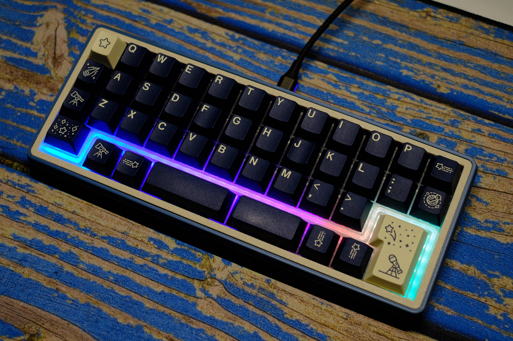
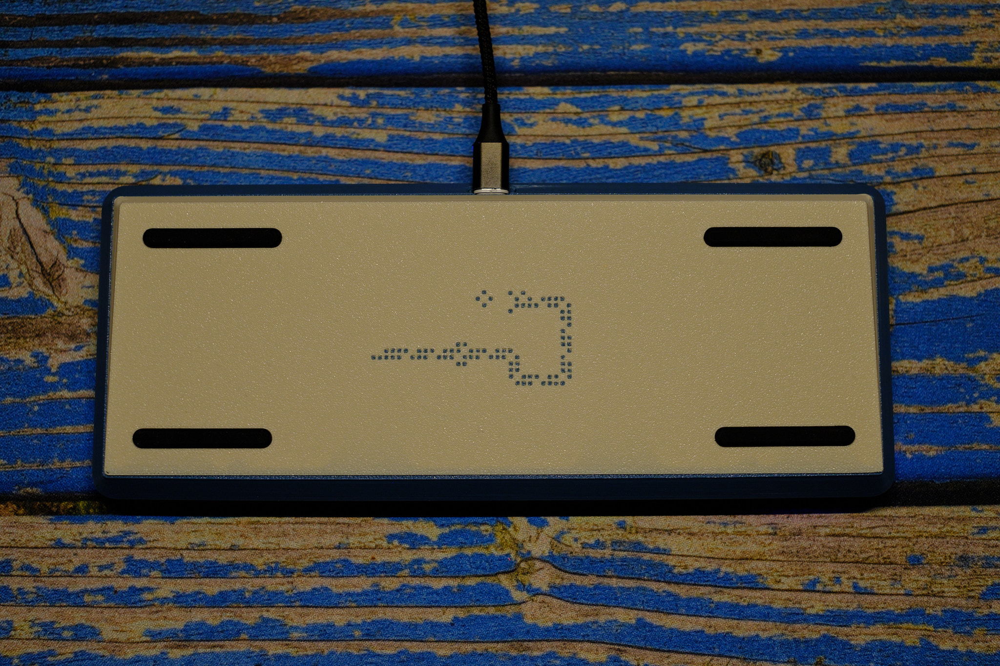
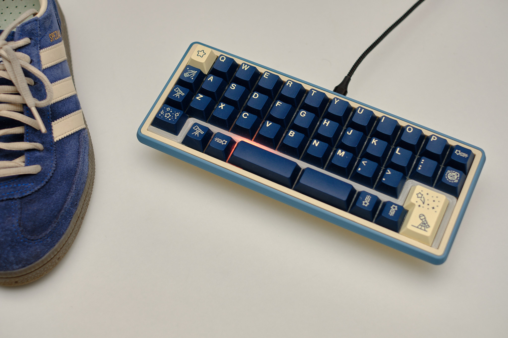

# Snake

A semi-ortholinear keyboard with LEDs, rotary encoder support and spacebar options.

## Idea, PCB and original case by 1000eyes, just added another case option

This version is designed for FDM-printing. Especially the foot has 0.25mm parts in the front, so Resin will probably not work. I have only modified snake on the split spacebar Plate. Others are untouched but still compatible. Only added some fillets for visual appeal.

### Part list for Moinboard-case
| #     | name                 | comments                                  |
|-------|----------------------|-------------------------------------------|
| 1     | Case printed (3 parts)  | whatever material you like  |
| 1     | Plate      | Printed in transparent material               |
| 4    | SKUF             | Feet                        |
| 2    | M2 short heat inserts              |                          |
| 2     | M2x4 or 5 screw      |                             |
| 6    | Printed soft inserts to hold the plate | print from very soft TPU or low infill. Instead of the rubber cord of the original case |

### Part list for the rest
| #     | name                 | comments                                  |
|-------|----------------------|-------------------------------------------|
| 1     | main PCB             | Order at fabricator of your choice (ouch, expensive!)        |
| 42    | hotswap sockets      | Whatever you are into                 |
| 42    | switches             | MX compatible                        |
| 42    | Keycaps              | MX-compatible                         |
| 1     | Rotary Encoder       | optional                             |

### Firmware

- Updated the Firmware with all Layoutoptions and improved the RGB so it works in VIAL.

## Acknowledgements

1000eyed for the great Layoutidea and execution, and one PCB for me!

